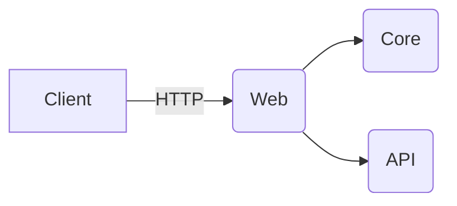

# Architektur, Module, Diagramme

**`docs/architecture.md`**

````md
# Architektur

-   Basis: Jellyfin (Backend: .NET, Frontend: Web)
-   Anpassungen: Branding, UI, Donate-Button
-   Container: Docker

## Module

-   Web-UI (angepasstes Styling, Komponenten)
-   Auth/Config (unverändert von Jellyfin, ggf. Branding-Hooks)
-   Integration: PayPal-Donate

## Diagramm (Beispiel-Mermaid)


````
